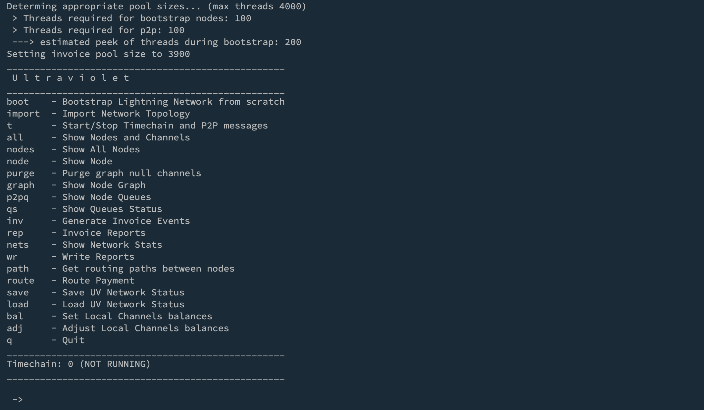

# UltraViolet

_**U**nifying **L**ightning **T**opology and **R**outing **A**bstractions **VI**sible **O**n **LE**vel **T**imechain_

UltraViolet (UV) is an open-source extensible high-level simulation platform for the Bitcoin
Lightning LNetwork, abstracting some of the major complexities of the underlying elements, while still providing a
timechain-level accuracy.

UV makes a massive usage of independent threads to make each abstracted Lightning Node a living entity in
its own "behavioral space".

The design principles of UV can be summarized in the following:

* Global scale control: complete control on nodes/channels and timechain events, with no need of credentials or deaing with cyptographic primitives
* Avoiding node deployment: customization of several node/protocol internal mechanisms while hiding the complexity of the a real node implementation

### Main features of Ultraviolet:

* **Timechain-level abstraction**: all the BOLT protocol events, Gossip/P2P messages, and funding/closing on-chain
  transactions, are simulated according to a scaled-down timechain flow, allowing a fast evaluation of several LN
  scenarios, while still providing a fine-grained block-level "vision" of the interactions with the base Bitcoin layer
* **Large-scale simulation**: Possibility of instantiating thousands of running nodes, where each can be characterized
  according to some common node features (funding, channel sizes distribution, frequency of opening/closing, cltv
  deltas, fees etc..)
* **Real Topology Testing**: support for pre-existing topologies imported from a json file, e.g. using the output of
  the _lncli describegraph_ command executed on a real node.
* **Pathfinding and Routing**: it is possible to test the routing of payment invoices, emulating the exchange of HTLC
  update/fulfill messages to experiment with new potential protocol evolutions, e.g., new routing strategies etc...

## Quick Start

* compile using the script from src dir: `./compile.sh`
* return to the main directory and execute:  _`java -jar UltraViolet.jar ./uv_configs/template.properties`_

The basic template file just considers 100 nodes for a quick test, but by customizing the properties file you can
experiment play with larger networks and other aspects of the deployed LN, including nodes behavior, channels,
fee/routing policies, p2p/gossip etc...

Just give at look at the comments in the properties file here to get an idea:
https://github.com/davidepatti/ultraviolet/blob/main/uv_configs/template.properties

### Exploring with UV

The above command will start the main menu:

 

You can try to bootstrap a network using the commmand "boot". After a while depending on your hardware and the number of
nodes, you will have a LN deployed.
*ALWAYS* check the log files to get a detailed understanding of what's happening under the hood. For example, you may see
here different events, and the related block time:

 

Also, as you can see when you refresh the menu hitting enter, the timechain is now up and running, and you can magically
start and stop it (with the "t" command"), actually freezing the time flow.

### Showing Nodes

The commands "all", "nodes", "node", "graph", "p2pq" are all useful for displaying, at various level, the current LN.
Please notice how, for sake of simplicity, each node and channel is given a simple handle to quickly.
The output of "node" command, showing the channels a features of the each channel:

 

The output of the "nodes" command, showing all nodes, along with customizable alias (currently mostly inspired to David
Lynch and Depeche Mode).

 

Please notice that each node has its own channel graph, build according to the received gossip messages (as in real LN).

### Deploying Events

The most basic action is performed with the "route" command, that simply tries to generate and route and invoice:

 

Again, don't forget to give a look to the logs to follow the details of what actually happened at the protocol level.

 

Also, an interesting possibility is to use the "inv" command to inject a whole set of LN events, automatically deployed over the network:

 

And the collected and characterized to produce statistical data such as failure rate and motivation of the failures,
e.g. missing liquidity, insufficient channel capacity, no routes, expired timelocks and so on. See the command "rep" for
a complete report, and "wr" to the export reports.

### Misc

The current status of the LN can be saved and restored later. 

The project is under development, and new features will be added. 
For example, we recently added a "bal" command to simulate a given umbalancing status of the channel.

## About

We started this project as part of our academic work at University of Catania, as a concrete way to contribute to the
Bitcoin/LN community that could create the basis for a future research activity and collaborations.
Use this software and have fun, every suggestion/help is welcome.
PS. We have a few scientific publication coming in the next months to be used as reference (shared here soon).

Feel free to join our LN node *lynchlight*,  pubkey:

03740f82191202480ace717fcdf00f71a8b1eb9bdc2bb5e2106cd0ab5cb4d7a54e

